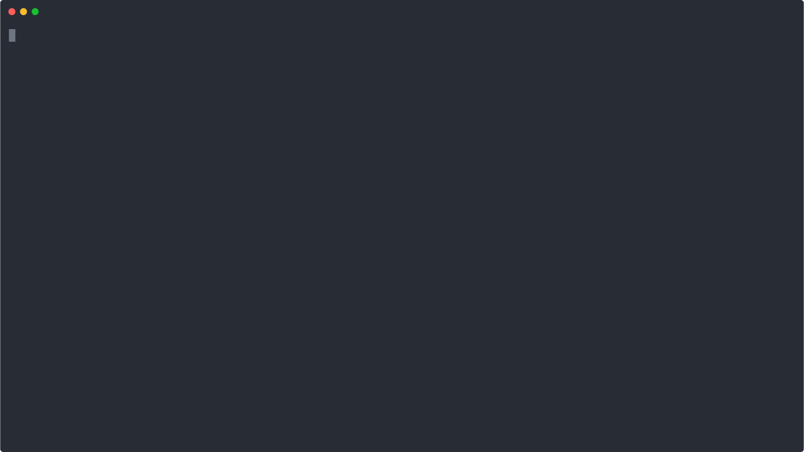
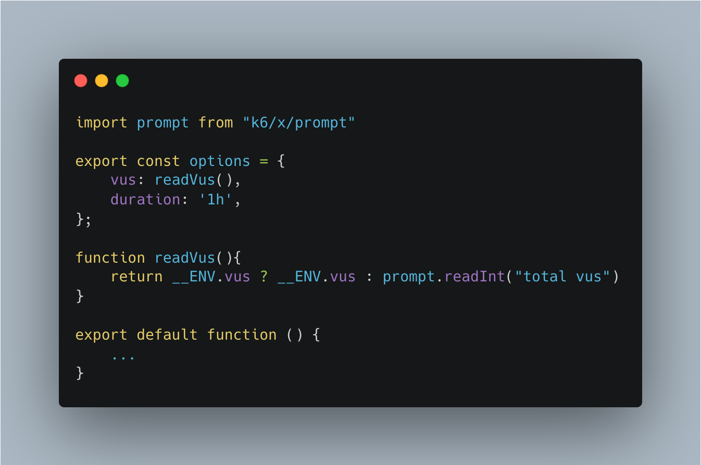

# xk6-prompt




k6 extension that adds support for input arguments via UI.


#### Install 

1. Install [xk6](https://github.com/grafana/xk6)
```shell
go install go.k6.io/xk6/cmd/xk6@latest
```
2. Build the extension using:

```shell
xk6 build --with github.com/Juandavi1/xk6-prompt@0.0.1
```

#### Import
```js
import prompt from 'k6/x/prompt';
```

> :warning: **If you are in a continuous testing environment, dont forget to add the conditional to read prompt inputs from [__ENV](https://k6.io/docs/using-k6/environment-variables/)**

> :warning: **Example: const myNumber = __ENV.value ? __ENV.value : prompt.readInt("enter number")**


#### Input select
```js
const options = ["smoke", "load"]
const selected = prompt.select("kind of test", ...options)
```

#### Read string
```js
const inputString = prompt.readString("type a string")
console.log(typeof inputString)
```

#### Read int
```js
const inputNumber = prompt.readInt("Type a number")
console.log(typeof inputNumber)
```

### [Options](https://k6.io/docs/es/usando-k6/opciones/) model 

