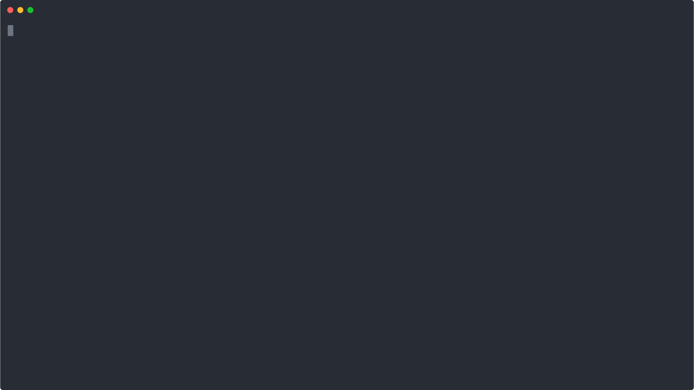

# xk6-prompt

[](https://github.com/Juandavi1/xk6-prompt/actions/workflows/go.yml)




_k6 extension that adds support for input arguments via UI._

#### Install

1. Install [xk6](https://github.com/grafana/xk6)
```console
go install go.k6.io/xk6/cmd/xk6@latest
```
2. Build the extension using:

```console
xk6 build --with github.com/Juandavi1/xk6-prompt
```

#### Import

```js
import prompt from 'bin/k6/x/prompt';
```


#### Input select
```js
export default function () {
  const options = ["smoke", "load"]
  const selected = prompt.select("kind of test", ...options)
  console.log(typeof selected === "string")
}
```

#### Read string
```js
export default function () {
  const inputString = prompt.readString("type a string")
  console.log(typeof inputString === "string")
}
```

#### Read int
```js
export default function () {
  const inputNumber = prompt.readInt("Type a number")
  console.log(typeof inputNumber === "number")
}
```

#### Read float
```js
export default function () {
  const inputNumber = prompt.readFloat("Type a float")
  console.log(typeof inputNumber === "number")
}
```

### Continuous Testing

If you are in a **continuous testing environment** you can pass the input arguments via environment variables.

Example:

#### 
```js
export default function () {
    const myNumber = __ENV.num ? __ENV.num : prompt.readInt("enter a number")
    console.log(typeof myNumber === "number")
}
```

And run the test with the environment variable:

```console
k6 run -e num=10 script.js
```


### Manually building from source

Install Go tools [1.19](https://golang.org/doc/install)

Clone this repo 
```console
git clone git@github.com:Juandavi1/xk6-prompt.git
```

Install dependencies
```console
make install
```

Build the extension binary
```console
make build
```

Execute the example using the extension binary
```console
make run
```

### Examples 

You can find more examples in the [examples](examples) folder.

<br/>

*#HavingFunLearning* 🦾
